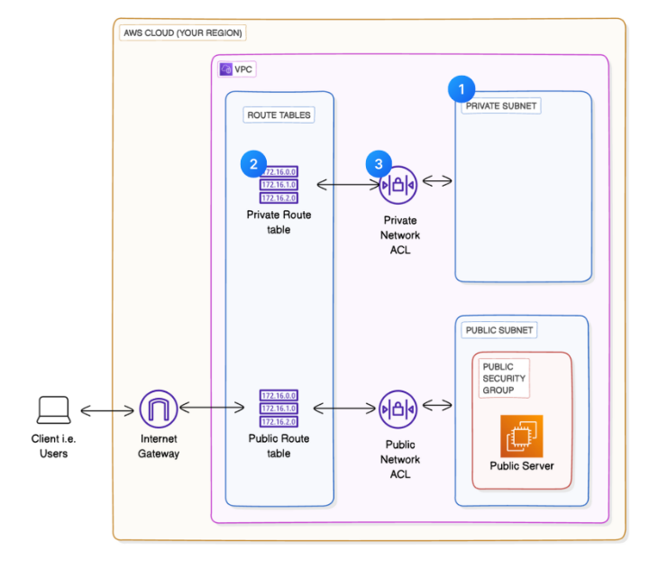

# Creating a Private Subnet in AWS VPC

This project demonstrates how to create a secure, isolated private subnet within an AWS Virtual Private Cloud (VPC) using Terraform. The implementation includes proper network segmentation, security controls, and infrastructure best practices for cloud networking.

## 📋 Project Overview

This Terraform configuration creates:
- A dedicated VPC with public and private subnets
- Internet Gateway for public subnet connectivity
- Separate route tables for public and private subnets
- Security groups and network ACLs for traffic control
- Network isolation between public and private resources

## 🏗️ Architecture



### Network Design
- **VPC CIDR**: 10.0.0.0/16 (65,536 IP addresses)
- **Public Subnet**: 10.0.0.0/24 (us-east-1a)
- **Private Subnet**: 10.0.1.0/24 (us-east-1b)

### Key Components
- **VPC**: Isolated network environment
- **Internet Gateway**: Provides internet access for public subnet
- **Route Tables**: Separate routing for public and private subnets
- **Security Groups**: Stateful firewall at instance level
- **Network ACLs**: Stateless subnet-level traffic filtering

## 🚀 Quick Start

### Prerequisites
- AWS CLI configured with appropriate credentials
- Terraform >= 1.0
- AWS account with VPC permissions

### Deployment Steps

1. **Clone the repository**
   ```bash
   cd creating-a-private-subnet
   ```

2. **Initialize Terraform**
   ```bash
   terraform init
   ```

3. **Review the configuration**
   ```bash
   terraform plan
   ```

4. **Deploy the infrastructure**
   ```bash
   terraform apply
   ```

5. **Verify deployment**
   ```bash
   terraform output
   ```

## 📁 Project Structure

```
creating-a-private-subnet/
├── main.tf              # Main Terraform configuration
├── variables.tf         # Input variables definition
├── outputs.tf           # Output values configuration
├── terraform.tfvars     # Variable values
├── README.md           # This documentation
├── architecture.png    # Network architecture diagram
├── .gitignore          # Git ignore rules
└── .terraform/         # Terraform working directory
```

## 🔧 Configuration Details

### Variables (variables.tf)
| Variable | Description | Default |
|----------|-------------|---------|
| `aws_region` | AWS region for resources | us-east-1 |
| `vpc_cidr` | VPC CIDR block | 10.0.0.0/16 |
| `public_subnet_1_cidr` | Public subnet CIDR | 10.0.0.0/24 |
| `private_subnet_1_cidr` | Private subnet CIDR | 10.0.1.0/24 |

### Outputs (outputs.tf)
- VPC ID and CIDR block
- Subnet IDs and CIDR blocks
- Security group information
- Route table IDs
- Availability zone information

## 🔒 Security Configuration

### Security Groups
- **Ingress**: HTTP (80) from anywhere
- **Egress**: All traffic allowed

### Network ACLs
- **Ingress**: Allow all inbound traffic
- **Egress**: Allow all outbound traffic
- Separate ACLs for public and private subnets

### Network Isolation
- Private subnet has no route to Internet Gateway
- Public subnet has direct internet access
- Separate route tables for different security zones

## 🌐 Network Connectivity

### Public Subnet
- ✅ Internet access via Internet Gateway
- ✅ Public IP assignment enabled
- ✅ Route to 0.0.0.0/0 via IGW

### Private Subnet
- ❌ No direct internet access
- ✅ Internal VPC communication
- ✅ Can communicate with public subnet
- Route table has no internet gateway route

## 🛠️ Usage Examples

### Deploy with Custom Values
```bash
terraform apply -var="aws_region=us-west-2" -var="vpc_cidr=192.168.0.0/16"
```

### Access Outputs
```bash
terraform output vpc_id
terraform output private_subnet_1_id
```

### Destroy Infrastructure
```bash
terraform destroy
```

## 📊 Monitoring and Troubleshooting

### Common Commands
```bash
# Check VPC status
aws ec2 describe-vpcs --vpc-ids $(terraform output -raw vpc_id)

# Verify subnets
aws ec2 describe-subnets --filters "Name=vpc-id,Values=$(terraform output -raw vpc_id)"

# Check route tables
aws ec2 describe-route-tables --filters "Name=vpc-id,Values=$(terraform output -raw vpc_id)"
```

### Troubleshooting Tips
- Ensure AWS credentials are properly configured
- Check for CIDR block overlaps in existing VPCs
- Verify IAM permissions for VPC creation
- Review AWS service limits in your account

## 🔄 Updates and Maintenance

### Adding More Subnets
1. Update `variables.tf` with new subnet CIDRs
2. Add subnet resources in `main.tf`
3. Update route table associations
4. Run `terraform plan` and `terraform apply`

### Security Updates
- Regularly review security group rules
- Monitor network ACL configurations
- Update Terraform provider versions

## 🧪 Testing

### Connectivity Tests
```bash
# Test public subnet connectivity
aws ec2 run-instances \
  --image-id ami-0abcdef1234567890 \
  --instance-type t2.micro \
  --subnet-id $(terraform output -raw public_subnet_1_id) \
  --security-group-ids $(terraform output -raw security_group_id)

# Test private subnet (requires NAT Gateway for internet access)
```

## 📚 Additional Resources

- [AWS VPC Documentation](https://docs.aws.amazon.com/vpc/)
- [Terraform AWS Provider](https://registry.terraform.io/providers/hashicorp/aws/latest)
- [AWS VPC Best Practices](https://docs.aws.amazon.com/vpc/latest/userguide/vpc-best-practices.html)

