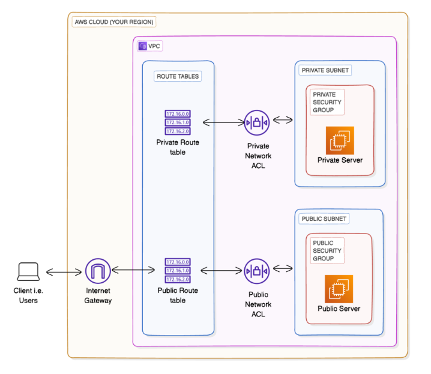

# NextWork VPC Resources Terraform Project

This Terraform project provisions a complete AWS VPC (Virtual Private Cloud) infrastructure with public and private subnets, security groups, network ACLs, and EC2 instances for the NextWork challenge.

## Architecture Overview



The infrastructure includes:

- **VPC**: `10.0.0.0/16` CIDR block with DNS support enabled
- **Internet Gateway**: Provides internet access to public resources
- **Public Subnet**: `10.0.0.0/24` in us-east-1a with public IP assignment enabled
- **Private Subnet**: `10.0.1.0/24` in us-east-1b (isolated from internet)
- **Route Tables**: Separate routing for public and private subnets
- **Security Groups**: 
  - Public SG: Allows SSH (22) and HTTP (80) from anywhere
  - Private SG: Allows SSH only from Public SG instances
- **Network ACLs**: Both public and private subnets have permissive ACLs
- **EC2 Instances**:
  - Public Server: t2.micro in public subnet with public IP
  - Private Server: t2.micro in private subnet (no public IP)

## Prerequisites

- AWS Account with appropriate permissions
- Terraform v1.12.2 or later
- AWS CLI configured with credentials
- SSH key pair named "NextWorkChallenge" in AWS

## Configuration

### Variables

The project uses the following configurable variables (defined in `variables.tf`):

| Variable | Description | Default Value |
|----------|-------------|---------------|
| `aws_region` | AWS region for resources | `us-east-1` |
| `vpc_cidr` | CIDR block for VPC | `10.0.0.0/16` |
| `public_subnet_1_cidr` | CIDR for public subnet | `10.0.0.0/24` |
| `private_subnet_1_cidr` | CIDR for private subnet | `10.0.1.0/24` |

### Terraform Configuration

The project uses:
- AWS Provider v5.100.0
- Latest Amazon Linux 2 AMI (free tier eligible)
- t2.micro instances (free tier eligible)

## Usage

### Initial Setup

1. **Clone the repository**:
   ```bash
   git clone <repository-url>
   cd launching-vpc-resources
   ```

2. **Initialize Terraform**:
   ```bash
   terraform init
   ```

3. **Review the execution plan**:
   ```bash
   terraform plan
   ```

### Deployment

1. **Apply the configuration**:
   ```bash
   terraform apply
   ```

   Confirm with `yes` when prompted.

2. **Monitor deployment progress**:
   Terraform will display the creation progress of all resources.

### Customization

To customize the deployment, create a `terraform.tfvars` file or use environment variables:

```hcl
# terraform.tfvars example
aws_region = "us-east-1"
vpc_cidr = "10.0.0.0/16"
public_subnet_1_cidr = "10.0.0.0/24"
private_subnet_1_cidr = "10.0.1.0/24"
```

Or use command-line flags:
```bash
terraform apply -var="aws_region=us-west-2" -var="vpc_cidr=192.168.0.0/16"
```

## Outputs

After successful deployment, Terraform will output the following information:

### VPC Information
- `vpc_id`: ID of the created VPC
- `vpc_cidr_block`: CIDR block of the VPC

### Networking Components
- `internet_gateway_id`: ID of the Internet Gateway
- `public_subnet_1_id`: ID of the public subnet
- `private_subnet_1_id`: ID of the private subnet
- `network_acl_id`: ID of the public Network ACL

### Security Groups
- `security_group_id`: ID of the public security group
- `private_security_group_id`: ID of the private security group

### EC2 Instances
- `ec2_instance_id`: ID of the public EC2 instance
- `ec2_instance_public_ip`: Public IP of the public instance
- `ec2_instance_public_dns`: Public DNS of the public instance
- `private_ec2_instance_id`: ID of the private EC2 instance
- `private_ec2_instance_private_ip`: Private IP of the private instance

## Security Considerations

### Public Security Group
- Allows SSH (port 22) from any IPv4 address (0.0.0.0/0)
- Allows HTTP (port 80) from any IPv4 address (0.0.0.0/0)
- Allows all outbound traffic

### Private Security Group
- Allows SSH (port 22) only from instances in the public security group
- Allows all outbound traffic

### Network ACLs
- Both public and private NACLs allow all inbound and outbound traffic
- Consider tightening these rules for production environments

## Network Architecture

### Public Subnet (10.0.0.0/24)
- Located in us-east-1a
- Has route to Internet Gateway (0.0.0.0/0 → igw)
- EC2 instances get public IP addresses automatically
- Accessible from the internet

### Private Subnet (10.0.1.0/24)
- Located in us-east-1b
- No internet gateway route (isolated)
- EC2 instances have only private IP addresses
- Accessible only from within the VPC

## Cost Considerations

- VPC: Free (no additional cost for VPC itself)
- Internet Gateway: Free
- Subnets: Free
- EC2 Instances: t2.micro instances are free tier eligible (750 hours/month)
- Data Transfer: Standard AWS data transfer pricing applies

## Maintenance

### Updating Resources
To modify the infrastructure:
1. Update the Terraform configuration files
2. Run `terraform plan` to review changes
3. Apply changes with `terraform apply`

### Destroying Resources
To tear down all resources:
```bash
terraform destroy
```

**Warning**: This will permanently delete all created resources.

## Troubleshooting

### Common Issues

1. **AWS Credentials**: Ensure AWS CLI is configured with valid credentials
2. **Key Pair**: The "NextWorkChallenge" key pair must exist in AWS
3. **Region Availability**: Some resources may not be available in all regions
4. **Resource Limits**: Check AWS service limits for your account

### SSH Access
To SSH into the public instance:
```bash
ssh -i /path/to/NextWorkChallenge.pem ec2-user@<public_ip>
```

To SSH into the private instance from the public instance:
```bash
ssh -i /path/to/NextWorkChallenge.pem ec2-user@<private_ip>
```

## File Structure

```
launching-vpc-resources/
├── main.tf              # Main Terraform configuration
├── variables.tf         # Input variables definition
├── outputs.tf          # Output values definition
├── terraform.tfvars    # Variable values (gitignored)
├── .terraform.lock.hcl # Provider version locking
├── .gitignore          # Git ignore rules
├── architecture.png    # Infrastructure diagram
└── README.md          # This file
```

## Dependencies

- HashiCorp AWS Provider (~> 5.0)
- AWS Account with appropriate permissions
- Terraform v1.12.2 or compatible version

## Support

For issues related to this Terraform configuration, check:
- Terraform documentation: https://www.terraform.io/docs
- AWS Provider documentation: https://registry.terraform.io/providers/hashicorp/aws/latest/docs
- AWS VPC documentation: https://docs.aws.amazon.com/vpc/

---

**Note**: Always review and understand the resources being created before applying Terraform configurations to avoid unexpected costs or security implications.
