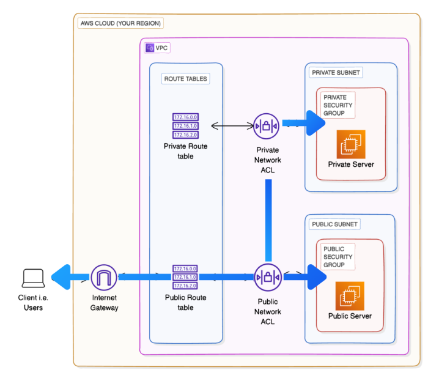

# VPC Connectivity Testing Module

This Terraform module creates a complete AWS VPC infrastructure with public and private subnets, designed specifically for testing network connectivity between different network components.

## Overview

The module provisions a VPC with:
- **Public Subnet**: Internet-facing subnet with public IP assignment
- **Private Subnet**: Isolated subnet without internet access
- **EC2 Instances**: One instance in each subnet for connectivity testing
- **Security Groups**: Custom security groups for controlled access
- **Network ACLs**: Additional network-level security controls
- **Route Tables**: Separate routing for public and private subnets

## Architecture



The architecture consists of:
- **VPC**: `10.0.0.0/16` CIDR block
- **Public Subnet**: `10.0.0.0/24` in first availability zone
- **Private Subnet**: `10.0.1.0/24` in second availability zone
- **Internet Gateway**: For public subnet internet access
- **EC2 Instances**: Amazon Linux 2 instances for testing

## Components

### VPC Resources
- **VPC**: `aws_vpc.nextwork_vpc` - Main VPC with DNS support enabled
- **Internet Gateway**: `aws_internet_gateway.nextwork_ig` - Internet connectivity for public subnet
- **Availability Zones**: Data source to get available AZs

### Subnets
- **Public Subnet**: `aws_subnet.public_subnet_1` - Public-facing subnet with auto-assigned public IPs
- **Private Subnet**: `aws_subnet.private_subnet_1` - Isolated subnet for internal resources

### Routing
- **Default Route Table**: `aws_default_route_table.nextwork_main_rt` - Main routing table
- **Internet Route**: `aws_route.internet_access` - Route to internet gateway
- **Private Route Table**: `aws_route_table.private_rt` - Isolated routing for private subnet
- **Route Table Associations**: Connections between subnets and route tables

### Security
- **Public Security Group**: `aws_security_group.nextwork_security_group` - Allows HTTP (80), SSH (22), and all outbound traffic
- **Private Security Group**: `aws_security_group.nextwork_private_security_group` - Allows SSH and ICMP from public security group only
- **Public Network ACL**: `aws_network_acl.nextwork_network_acl` - Permissive network ACL for public subnet
- **Private Network ACL**: `aws_network_acl.nextwork_private_network_acl` - Allows ICMP from public subnet for testing

### Compute Resources
- **Public EC2 Instance**: `aws_instance.nextwork_public_server` - t2.micro instance in public subnet
- **Private EC2 Instance**: `aws_instance.nextwork_private_server` - t2.micro instance in private subnet
- **AMI**: Latest Amazon Linux 2 AMI (free tier eligible)

## Configuration Variables

| Variable | Description | Default Value |
|----------|-------------|---------------|
| `aws_region` | AWS region for resources | `us-east-1` |
| `vpc_cidr` | CIDR block for VPC | `10.0.0.0/16` |
| `public_subnet_1_cidr` | CIDR block for public subnet | `10.0.0.0/24` |
| `private_subnet_1_cidr` | CIDR block for private subnet | `10.0.1.0/24` |

## Outputs

The module provides comprehensive outputs for integration and testing:

### VPC Outputs
- `vpc_id` - ID of the NextWork VPC
- `vpc_cidr_block` - CIDR block of the VPC

### Networking Outputs
- `internet_gateway_id` - ID of the Internet Gateway
- `public_subnet_1_id` - ID of the public subnet
- `private_subnet_1_id` - ID of the private subnet
- `availability_zone` - AZ where resources are created

### Security Outputs
- `security_group_id` - ID of the public security group
- `private_security_group_id` - ID of the private security group
- `network_acl_id` - ID of the network ACL

### EC2 Instance Outputs
- `ec2_instance_id` - ID of the public EC2 instance
- `ec2_instance_public_ip` - Public IP of the public instance
- `private_ec2_instance_id` - ID of the private EC2 instance
- `private_ec2_instance_private_ip` - Private IP of the private instance

## Usage

### Prerequisites
- AWS account with appropriate permissions
- Terraform installed
- AWS CLI configured with credentials
- SSH key pair named "NextWorkChallenge" in AWS

### Deployment

1. **Initialize Terraform**:
   ```bash
   terraform init
   ```

2. **Plan deployment**:
   ```bash
   terraform plan
   ```

3. **Apply configuration**:
   ```bash
   terraform apply
   ```

4. **Destroy resources**:
   ```bash
   terraform destroy
   ```

### Connectivity Testing

After deployment, you can test connectivity:

1. **Public instance access**:
   ```bash
   ssh -i your-key.pem ec2-user@$(terraform output -raw ec2_instance_public_ip)
   ```

2. **Test private instance connectivity from public instance**:
   ```bash
   # From public instance
   ping $(terraform output -raw private_ec2_instance_private_ip)
   ssh -i NextWorkChallenge.pem ec2-user@$(terraform output -raw private_ec2_instance_private_ip)
   ```

3. **Test internet connectivity**:
   ```bash
   # From public instance
   curl http://example.com
   
   # From private instance (should fail)
   curl http://example.com
   ```

## Security Considerations

- The public security group allows SSH from anywhere (0.0.0.0/0) - restrict this in production
- Private security group only allows SSH and ICMP from the public security group
- Network ACLs provide additional layer of security
- Consider using more restrictive CIDR blocks for production environments

## Cost Considerations

- Uses t2.micro instances (free tier eligible)
- VPC components have minimal cost impact
- Monitor usage to avoid unexpected charges

## Troubleshooting

### Common Issues

1. **SSH Key Issues**: Ensure "NextWorkChallenge" key pair exists in AWS
2. **CIDR Conflicts**: Verify no overlapping CIDR blocks in your AWS account
3. **Permission Errors**: Check IAM permissions for Terraform user
4. **Connectivity Problems**: Verify security group and NACL rules

### Debugging

- Use `terraform plan` to preview changes
- Check CloudTrail logs for API errors
- Review VPC Flow Logs for network traffic analysis
- Use instance console output for boot issues

