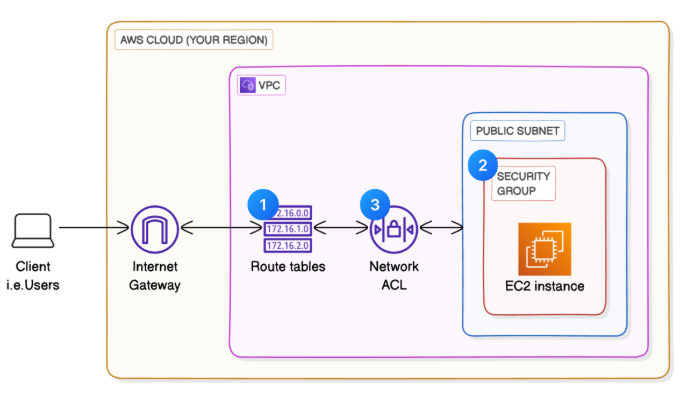

# VPC Traffic Flow and Security Project

## Overview
This project demonstrates the implementation of a secure, well-architected AWS Virtual Private Cloud (VPC) with comprehensive traffic flow controls and security measures. The infrastructure is built using Terraform and provides a foundation for deploying applications with proper network segmentation, security controls, and traffic monitoring capabilities.

## Architecture


The architecture implements a single public subnet VPC with:
- **VPC**: 10.0.0.0/16 CIDR block
- **Public Subnet**: 10.0.0.0/24 in us-east-1a
- **Internet Gateway**: For outbound internet access
- **Security Groups**: Stateful firewall at the instance level
- **Network ACLs**: Stateless subnet-level traffic filtering
- **Route Tables**: Custom routing for traffic flow control

## Project Structure
```
vpc-traffic-flow-and-security/
├── main.tf              # Core infrastructure resources
├── variables.tf         # Input variables configuration
├── outputs.tf           # Output values for resources
├── terraform.tfvars     # Variable values
├── terraform.tfstate    # State file (managed by Terraform)
├── architecture.png     # Visual architecture diagram
├── .gitignore          # Git ignore rules
└── README.md           # This documentation
```

## Infrastructure Components

### 1. Virtual Private Cloud (VPC)
- **CIDR Block**: 10.0.0.0/16 (65,536 IP addresses)
- **DNS Hostnames**: Enabled for EC2 instances
- **DNS Support**: Enabled for DNS resolution
- **Region**: us-east-1

### 2. Internet Gateway
- Provides internet connectivity for public subnets
- Attached to the VPC for outbound traffic routing
- Enables bidirectional internet communication

### 3. Public Subnet
- **CIDR**: 10.0.0.0/24 (256 IP addresses)
- **Availability Zone**: us-east-1a
- **Auto-assign Public IP**: Enabled for instances
- **Route Table Association**: Connected to main route table

### 4. Route Table Configuration
- **Main Route Table**: Manages traffic flow for the VPC
- **Internet Route**: 0.0.0.0/0 → Internet Gateway
- **Subnet Association**: Public subnet 1 associated

### 5. Security Groups
- **Name**: NextWork Security Group
- **Inbound Rules**:
  - HTTP (80/tcp) from anywhere (0.0.0.0/0)
- **Outbound Rules**:
  - All traffic (0.0.0.0/0) allowed
- **Stateful**: Return traffic automatically allowed

### 6. Network Access Control Lists (NACLs)
- **Name**: NextWork Network ACL
- **Inbound Rules**:
  - Rule 100: Allow all traffic from anywhere
- **Outbound Rules**:
  - Rule 100: Allow all traffic to anywhere
- **Stateless**: Explicit rules required for both directions
- **Subnet Association**: Applied to public subnet

## Traffic Flow Patterns

### Inbound Traffic Flow
1. **Internet → Internet Gateway**
   - Traffic enters through the Internet Gateway
   - Routed via the 0.0.0.0/0 route in the route table

2. **Internet Gateway → Subnet**
   - Traffic flows to the associated subnet
   - NACL rules evaluated first (stateless)

3. **Subnet → Instance**
   - Security group rules evaluated (stateful)
   - Instance-level filtering applied

### Outbound Traffic Flow
1. **Instance → Security Group**
   - Outbound security group rules evaluated
   - Stateful connection tracking allows return traffic

2. **Security Group → NACL**
   - NACL outbound rules evaluated
   - Stateless filtering applied

3. **NACL → Internet Gateway**
   - Route table directs traffic to Internet Gateway
   - Traffic exits to the internet

## Security Controls

### Layer 1: Network ACLs (Subnet Level)
- **Stateless**: Each packet evaluated independently
- **Order-based**: Rules processed in numerical order
- **Bidirectional**: Separate rules for inbound/outbound
- **Default**: Allow all traffic (customizable)

### Layer 2: Security Groups (Instance Level)
- **Stateful**: Return traffic automatically allowed
- **Default**: Deny all inbound, allow all outbound
- **Flexible**: Can reference other security groups
- **Scalable**: Applied to multiple instances

### Layer 3: Instance-Level Security
- Operating system firewalls
- Application-level security
- Encryption in transit (TLS/SSL)

## Variables Configuration

| Variable | Description | Default | Type |
|----------|-------------|---------|------|
| aws_region | AWS region for resources | us-east-1 | string |
| vpc_cidr | CIDR block for VPC | 10.0.0.0/16 | string |
| public_subnet_1_cidr | CIDR for public subnet 1 | 10.0.0.0/24 | string |

## Outputs

| Output | Description |
|--------|-------------|
| vpc_id | ID of the NextWork VPC |
| vpc_cidr_block | CIDR block of the VPC |
| internet_gateway_id | ID of the Internet Gateway |
| public_subnet_1_id | ID of the public subnet |
| security_group_id | ID of the security group |
| network_acl_id | ID of the network ACL |
| availability_zone | AZ where resources are created |

## Deployment Instructions

### Prerequisites
- AWS CLI configured with appropriate credentials
- Terraform installed (version 1.0+)
- AWS account with necessary permissions

### Steps
1. **Clone the repository**
   ```bash
   git clone <repository-url>
   cd vpc-traffic-flow-and-security
   ```

2. **Initialize Terraform**
   ```bash
   terraform init
   ```

3. **Review the plan**
   ```bash
   terraform plan
   ```

4. **Apply the configuration**
   ```bash
   terraform apply
   ```

5. **Verify deployment**
   ```bash
   terraform output
   ```
